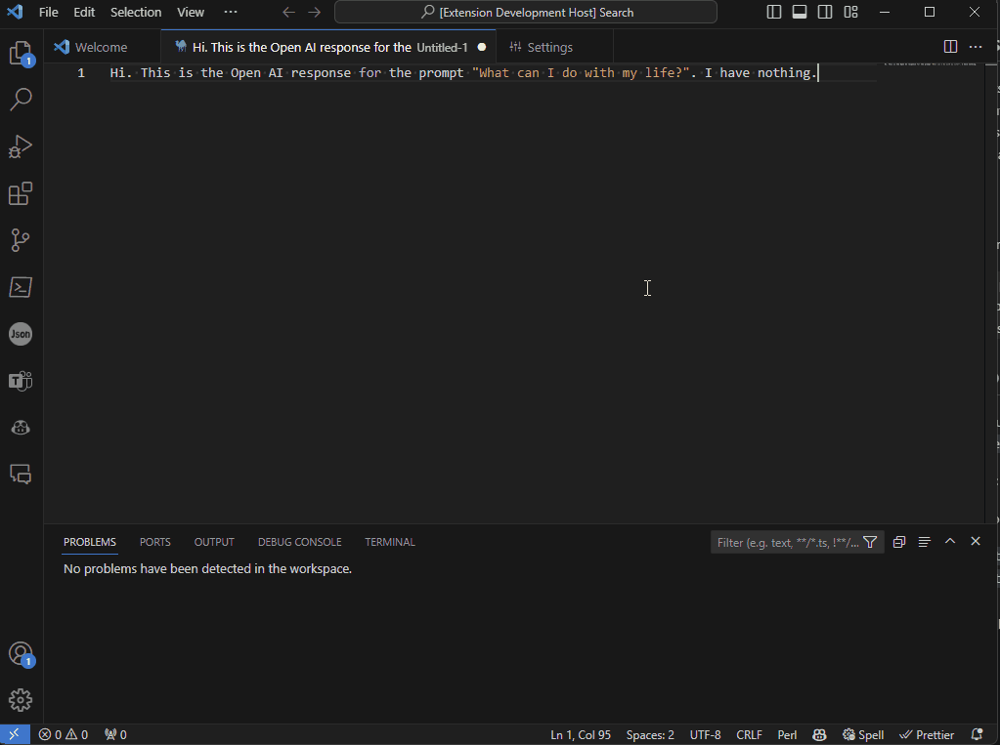

# tiktokens README

This extension counts and outputs the OpenAI models tokens based on the tiktoken tokeniser library.
See https://github.com/openai/tiktoken

## Features

- Counts the tokens for selected text
- Outputs the tokens to a new file

## Extension Settings

This extension contributes the following settings:
* `tiktokens.encoderForModel`: The model used for encoding.

See https://github.com/openai/tiktoken for model names

## Release Notes
Yet to be published to vscode marketplace. Available as pre-release here:
https://github.com/itamarbarkaims/tiktokens/releases/tag/v0.0.1

---
